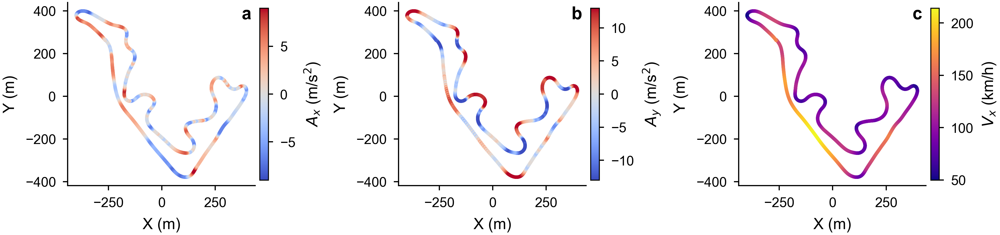

# CarSimDRL: A Lightweight Vehicle Dynamics Deep Reinforcement Learning Environment

This repository is a restricted partial release for the paper on LSTM-SAC-based high-speed racing control of a four-wheel-independent-drive electric vehicle in CarSim.

The current version keeps the high-level training entry script and the generic CarSim Python wrapper utilities that are not specific to the paper contribution. The paper-specific implementations, including the LSTM feature extractor, racing environment, and four-wheel-independent-drive racing vehicle interface, are intentionally not included in this public version.

## Current release scope

Included:

- `scripts/train_sac_lstm_carsim_time_related_v4_racing.py`: the main training pipeline showing how SAC is configured and launched.
- `pycarsimlib/`: generic CarSim Python wrapper utilities and non-paper vehicle model examples.
- `requirements.txt`: Python package dependencies used by the research code.
- `LICENSE`: repository license.
- `.gitignore`: filters for generated results, model checkpoints, logs, CarSim assets, and local IDE files.

Not included:

- CarSim databases, `.cpar` files, solver binaries, or commercial vehicle/road assets.
- The Gymnasium racing environment used in the paper.
- The LSTM feature extractor used by SAC.
- The paper-specific four-wheel-independent-drive racing vehicle interface.
- Custom callbacks, reward details, result-analysis scripts, trained models, logs, and CSV results.

## Repository structure

```text
CarsimDRL/
  assets/
    Fig4.png
  pycarsimlib/
    api/
    models/
      normal_vehicle.py
      in_wheel_motored_vehicle.py
    core.py
    logger.py
  scripts/
    train_sac_lstm_carsim_time_related_v4_racing.py
  README.md
  requirements.txt
  LICENSE
```

## Important note

The current training script is not intended to run out of the box. It preserves the main training logic and hyperparameter configuration used in the paper, while several required paper-specific modules are withheld. The missing modules are listed in the TODO section below.

The restored `pycarsimlib` package is provided as a generic CarSim interface reference. The paper-specific four-wheel-independent-drive racing model has been removed from this release.

## Training entry overview

The retained training script shows the main experimental configuration:

- Algorithm: Soft Actor-Critic (SAC).
- Policy: `MlpPolicy` with a custom LSTM feature extractor.
- Actor/Critic MLP architecture: `[64, 64]`.
- Learning rate, replay buffer size, warm-up steps, batch size, and save frequency are read from the training arguments.
- Fixed SAC parameters used in the paper include `tau=0.005`, `gamma=0.99`, and `ent_coef=0.1`.
- The target environment name is `env_carsim_time_related_v4`.

## Demonstration result

The following figure is a representative closed-loop test result reported in the paper. It visualizes the vehicle trajectory on the racing track, where the same X-Y path is colored by longitudinal acceleration, lateral acceleration, and vehicle speed. This figure is provided only as a qualitative demonstration of the trained controller behavior; the underlying evaluation CSV files and plotting scripts are not included in this partial release.



## TODO for future open-source release

The following code is required for full reproduction but has been removed from this partial release:

- [ ] `custom_policy/sac_lstm_mlp_policy.py`: implement and release the LSTM feature extractor used by SAC.
- [ ] `sim_env/env_carsim_time_related_v4.py`: implement and release the Gymnasium-compatible CarSim racing environment.
- [ ] `sim_env/__init__.py`: register `env_carsim_time_related_v4` after the environment implementation is released.
- [ ] `pycarsimlib/models/mormal_vehicle_4wd.py`: release a sanitized four-wheel-independent-drive racing vehicle interface.
- [ ] `pycarsimlib/models/normal_vehicle_simfile.txt`: provide a non-proprietary example simulation file template if redistribution is permitted.
- [ ] `sb_call_back/custom_sb3_callback.py`: release the TensorBoard callback used for episode-level training curves.
- [ ] `utils/arg_builder.py`: replace the internal argument helper with a public `argparse` or `typer` interface.
- [ ] `reward/veh_dyn_reward.py`: release the reward helper functions if they are needed for a runnable baseline.
- [ ] `scripts/evaluate_policy.py`: release a sanitized evaluation script.
- [ ] `scripts/analyze_four_motor_potential.py`: release paper plotting and torque-analysis scripts after removing local paths and result dependencies.

## Requirements

Install Python dependencies with:

```bash
pip install -r requirements.txt
```

A licensed local CarSim installation is required for the full research system. CarSim itself and any CarSim-related commercial assets are not included in this repository.

## License

This repository is released under the license provided in `LICENSE`. CarSim itself and any commercial CarSim assets are not covered by this repository license.


